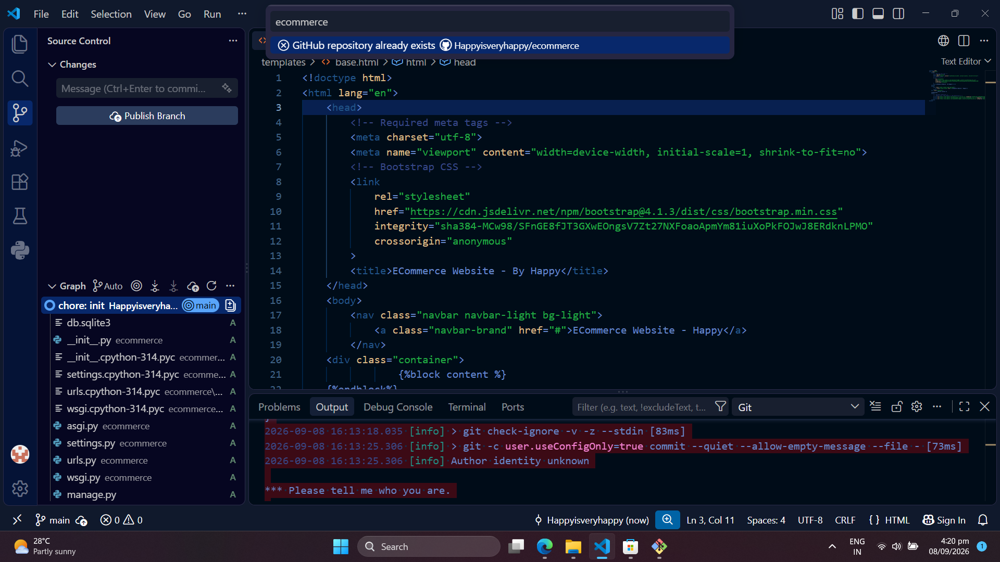
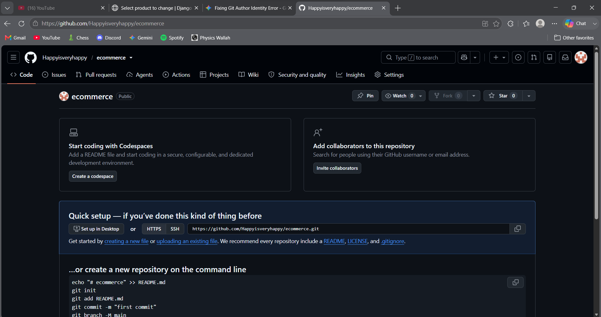
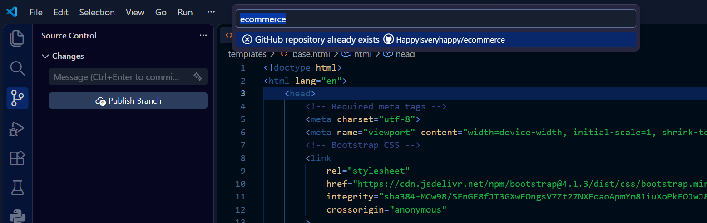

# E-Commerce - My First Django Project

Welcome to my very first project built with Django! 

I created this simple e-commerce website by following a tutorial to get a solid grasp of the basics. I'm focusing on understanding how everything works under the hood, so there is **no AI-generated code here**—just manual typing, debugging, and pure learning.

## Project Goals & What I've Learned
- Learn the fundamentals of Django (Models, Views, Templates, URLs).
- Understand project structure and routing.
- Practice HTML/CSS integration (using Bootstrap).
- Basics of Python & how to work in a multi file structure in this language
- Some basic libraries (OS, Random)
- Using **very basic** HTML & premade components (bootstrap)

## Screenshots

