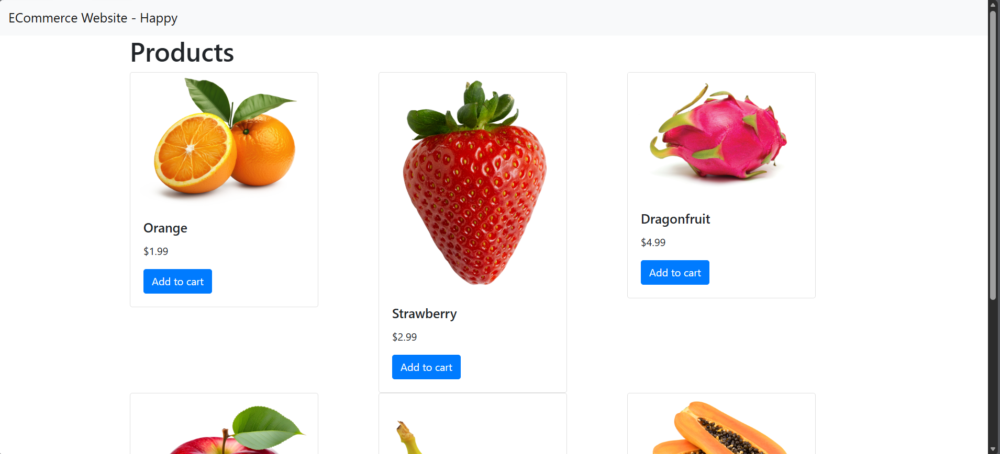
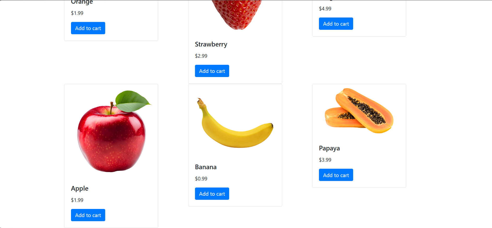
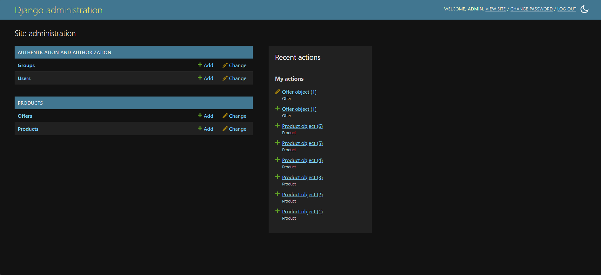
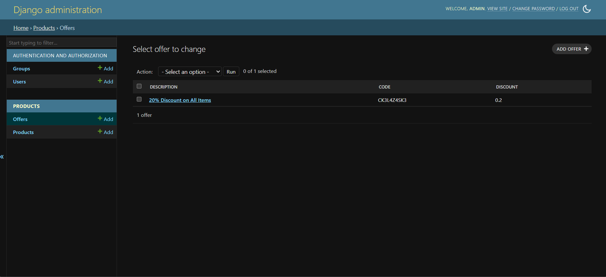
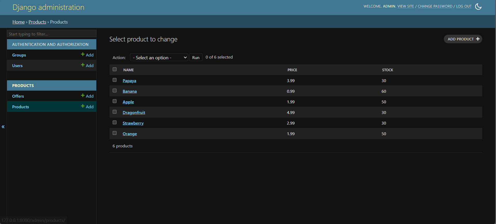

# E-Commerce - My First Django Project

## Welcome to a very simple project built with Python & Django! 

I created this simple e-commerce website by following a [tutorial](https://www.youtube.com/watch?v=_uQrJ0TkZlc) to get a solid grasp of the basics. I'm focusing on understanding how everything works under the hood, so there is **no AI-generated code here**. PS: I know the UI/UX is very bad, alot of it doesn't work, but maybe I'll be finishing this and transforming it into an actual website that can be used for production.

Note:
Admin Panel Username: `admin`
Admin Panel Password: `1234`

### Ideas for the future me:
- Make the add to cart system working
- Make a /cart page where it shows your cart, order details, etc.
- Make a mock checkout page and add an order in the admin dashboard where you can change order status (pending, shipped, delivered, etc.)
- Maybe add actual PayPal/Stripe integration.
- Add auth/user login system using Django auth

### Project Goals & What I've Learned
- Learn the fundamentals of Django (Models, Views, Templates, URLs).
- Understand project structure and routing.
- Practice HTML/CSS integration (using Bootstrap).
- Basics of Python & how to work in a multi file structure in this language
- Some basic libraries (OS, Random)
- Using **very basic** HTML & premade components (bootstrap)

### Screenshots:

